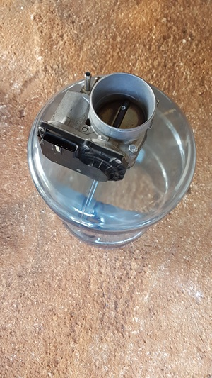

# Dog-Feeder-Prototype-1
Feeding dogs over the internet

My father lives in a somewhat remote area. He travels off island every few months, leaving a dog behind. That's where my project comes in.
The issue is having to drive 30 minutes to feed the dog and another 30 minutes back home. Repeat for Otis's breakfast, lunch and dinner. That's a lot of time wasted driving, not to mention inconvenient. Living half an hour away in an apartment that doesn't allow dogs limits my options. 
That's when this idea came to mind. A remote feeding system.
   
## Getting parts together
While working at my last job in an auto shop, I was able to get my hands on a used electric throttle body. It was perfect for keeping cereal in when fully closed, and letting cereal out when opened. Next I used an old 5 gallon water container to hold the cereal. First I sawed the wide bottom off so I can fill it. Then I sawed the neck off the top to mount the throttle body with nuts and bolts, allowing it to dispense the food. In order to keep the dog away from the food that has not yet been dispensed, I had to mount the whole assembly out of paw's reach. A flexible pipe was used to help guide the food to the bowl.

    

## Raspberry Pi
To control the throttle body used my Raspberry Pi. The Pi is a micro computer that has GPIO pins that allow me to connect to the real world. Using python, I am able to power up anything with the 3.3V pins or the 5V pins. 
Powering a 12V car part would require a 12V car battery. The Pi's 5 volts is definitely not enough, and in fact may even burn out the computer itself. The solution is a relay, which takes a lower power source's input to switch on a higher power circuit.
I wrote a simple program to actuate the throttle body when I typed in "feed." I then hooked up remote access using the Raspberry Pi's built in VNC allowing me to feed the dog anywhere through the internet.

    
 
## Upgrades
After using the feeder for only a day, the need to upgrade was necessary. I was unable to see how much food Otis was getting, so I set up a webcam to take photos after dispensing food. The photos were saved on the computer's drive for me to view remotely. Then another issue came up. At night, it was too dark. I had to install a light right beneath the 5 gallon container to light up the bowl in the dark. It would act as a flash, switching on only during photos. These upgrades completed my prototype feeding system. 

    
